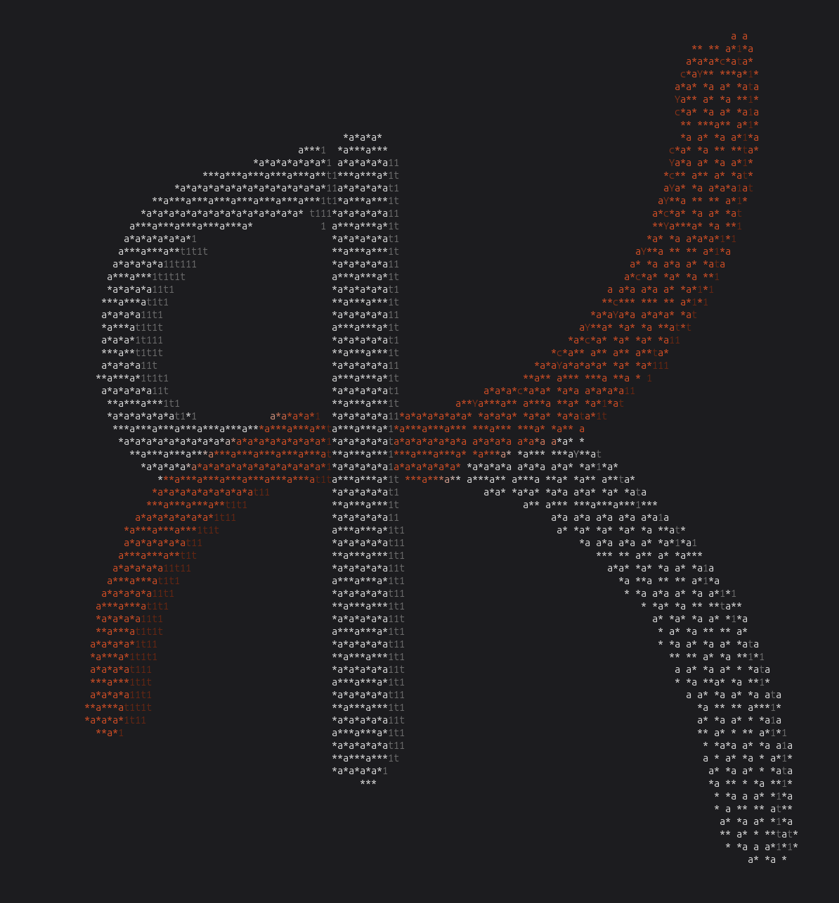

# Kir-Console

Kir-Console loads a PNG, extrudes the opaque pixels into a thin slab, and spins that slab in the terminal. The picture is drawn with characters. On a color terminal the original logo colors are kept and dimmed by a single light.



## Build and run

You need a C compiler and the math library. From this directory:

```bash
make
./Kir-Console
```

Quit with Ctrl+C.

## Options

```text
./Kir-Console [image.png] [--tilt degrees]
```

The default image is `Kir-Dev-White.png`, if not specified this is what load automatically.

`--tilt N` sets the backward tilt in degrees. The default is 10. The number can come before or after the image path.

```bash
./Kir-Console --tilt 20
./Kir-Console Kir-Dev-White.png --tilt 12.5
```

`N` has to be a number. `--tilt` with a missing or invalid value prints a usage line and exits.

## What it does

- Builds a front, a back, and side walls from the silhouette, then spins the slab around the vertical axis.
- Shades each frame with a directional light. Brightness eases as a face turns from the camera toward the side, instead of jumping between characters.
- Draws the extruded rim darker than the face it meets, so the thickness stays visible.
- Uses the PNG's own colors when stdout is a terminal. Piped output is characters only.
- Redraws to the current terminal size, including after a resize, at about 30 frames per second.

## Images

A PNG with a transparent background works best. A high-contrast logo on a dark or light background works too. Padding around the mark is cropped, and thin strokes are kept when the image is scaled down to the mesh.
